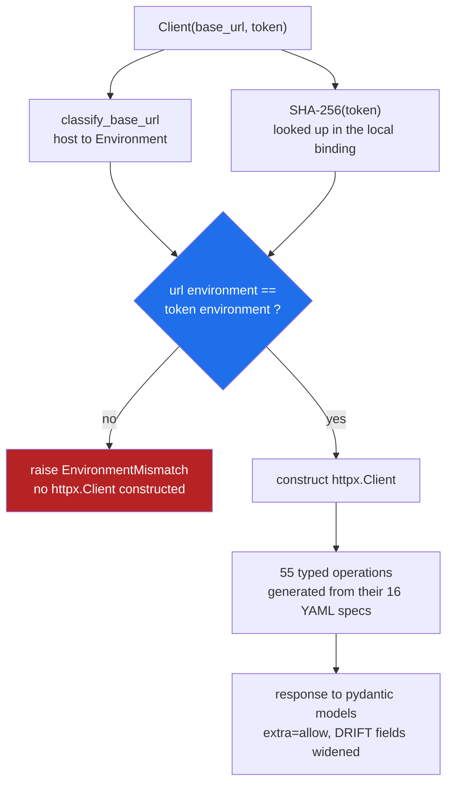
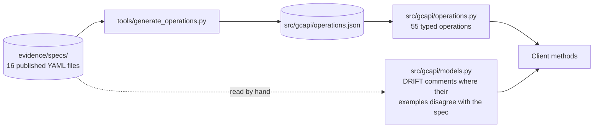

# gcapi

An unofficial, typed Python client for the GiveCampus API, plus a CLI that checks
whether a token is allowed to talk to a base URL **before** it sends anything.

Built entirely from GiveCampus' published documentation. **No request was made to
`www.givecampus.com/api` or `sandbox.givecampus.com/api` at any point**, with or without
a credential. This is a fundraising platform holding donor and payment records; the
correct amount of unsolicited traffic against it is zero. The test suite enforces this
structurally rather than by promise (`tests/test_no_live_calls.py`).

---

## The short version

**The problem.** GiveCampus publishes an API and ships no client library in any language, and
the docs warn that production and sandbox tokens are not interchangeable. That warning is the
whole issue: the two tokens look identical, so pointing the wrong one at the wrong environment
fails silently rather than loudly, and this is a platform moving real donations for real
institutions.

**What I built.** A typed Python client covering **55 operations generated from their own 16
YAML specs** rather than hand-written, plus a CLI that refuses to fire when the token does not
match the environment you are targeting.

**How it solves it.** The environment check runs inside `__init__`, before any `httpx.Client`
is constructed, so a mismatched token cannot reach the network at all instead of being caught
by a 401 after the request has already left. Since GiveCampus publishes no token format, it
binds `SHA-256(token)` to an environment locally rather than guessing at a prefix, and the
token never touches disk. Generating the models from the specs rather than typing them means
the client cannot silently drift from the API as it changes.

**Why this is worth something to GiveCampus.** Three things. Every integration partner
currently writes this layer themselves, so the same mistakes get made repeatedly and land in
your support queue rather than in a shared library. A guard that fails before the request
leaves turns a class of silent data errors into a startup error, which is the difference
between a confusing support ticket and a developer fixing their own config in ten seconds. And
the generated models surface spec drift the moment it appears, which is how I found the six
issues below without ever calling the API.

**What I found on the way.** Their example payloads disagree with their own spec in **six
places**, including `subscription.id` typed as a string but shown as the integer `2295`, and a
misspelled `constituent_identifer` sitting in a payload next to the correctly spelled one. Two
spec files also disagree on `limited_months` versus `limited_monthly`. The models widen exactly
those fields, each marked `# DRIFT:` inline, and keep unknown keys with `extra="allow"` so
nothing silently vanishes from a donor record.

**81 tests, fully offline, and no request was ever sent to GiveCampus.** This handles donor and
payment data, so the whole thing is built against published documentation and fixtures taken
from their own examples. That constraint is enforced in the code, not promised in a sentence.

**What it is not.** Untested against the live API by design, so read the drift list as "their
published material disagrees with itself" rather than "the server returns this."

## Why the CLI half exists

GiveCampus documents this, in their own words:

> **API tokens are environment-specific:**
> - Tokens created in production won't work in the sandbox and vice versa.
> - Generate a unique API token in each environment.
>
> **Testing tips:**
> - When copying example curl commands or sample code from production documentation,
>   update the base URL and replace the Authorization token with your sandbox token.
>
> -- <https://support.givecampus.com/hc/en-us/articles/29093649557527-GiveCampus-API-A-Deep-Dive-on-Parameters>

Two independent things have to change together, and nothing checks that both did. Their
troubleshooting guide also puts a wrong-environment token in the checklist for a Gifts
query that returns HTTP 200, `status: completed`, and an empty array, which is a quiet
outcome rather than a loud one.

`gcapi preflight` answers "may this token be sent to this base URL?" offline, and exits
`3` if the answer is no. It is one line in a cron job or a CI step, before the sync runs.

```
$ gcapi preflight --token "$GIVECAMPUS_TOKEN" --base-url https://www.givecampus.com/api
[STOP] Refusing to send a sandbox token to a production base URL
       (https://www.givecampus.com/api). GiveCampus documents that tokens created in
       production will not work in the sandbox and vice versa; generate a token in the
       environment you are targeting.
       base URL         : https://www.givecampus.com/api
       URL environment  : production
       token environment: sandbox (source: token-store binding)
       token sha256     : 832bc43e5b77c7ca...
$ echo $?
3
```

Full transcript: [`evidence/cli-demo.txt`](evidence/cli-demo.txt).

### How it knows which environment a token belongs to

Honestly: **GiveCampus does not publish a token format.** The entire specification of the
credential's shape is `Bearer XXXXXXXXXXXXX`. So there is no way to look at a token
string and know where it came from, and this tool does not pretend there is. It
establishes the pairing the two ways that actually hold up offline:

1. **Declared** - you pass `--environment production|sandbox` for this run.
2. **Bound** - `gcapi bind` records `SHA-256(token) -> environment` once, in a local
   file, and every later run checks the fingerprint against the target host. **The token
   itself is never written to disk**, only its hash and your label.

A third signal, JWT claim inspection, runs and is reported but is *never* allowed to
decide, because the format is undocumented and a guess here is worse than an abstention.

The guard **fails closed**. An unbound token, or a host that is not one of the two
documented ones, is a refusal, not a shrug. Schools running the API on a custom domain
(which GiveCampus' partners document) register it once with `gcapi register-host`.

---

## Where the guard sits

The environment check runs inside `Client.__init__`, before any `httpx.Client`
exists. A mismatched token cannot reach the network to be rejected by a 401; there
is no socket yet.



GiveCampus publishes no token format, so the binding is local: the SHA-256 of a
token is associated with an environment on your machine. The token itself never
touches disk.

## How the client is generated



Regenerating is `python tools/generate_operations.py`. Hand-editing
`operations.py` is not the workflow: the specs are the source.

## Install and run

```bash
uv venv --python 3.12 .venv
uv pip install --python .venv/bin/python -e '.[dev]'

.venv/bin/python -m pytest      # 81 tests, offline, ~0.2s
.venv/bin/gcapi endpoints       # the 55 operations, parsed from their specs
```

## CLI

| command | what it does |
|---|---|
| `gcapi preflight` | check a token against a base URL, sending nothing. Exit `3` on mismatch |
| `gcapi bind` | record which environment a token belongs to (stores a SHA-256, not the token) |
| `gcapi unbind` | forget a binding |
| `gcapi register-host` | map a school's custom domain to an environment |
| `gcapi bindings` | list what is recorded |
| `gcapi endpoints` | print all 55 documented operations with their source spec URLs |
| `gcapi gifts` | run a Gifts query end to end: preflight, submit, poll, download |

Exit codes: `0` ok, `2` usage, `3` environment mismatch, `4` API error.

Token is read from `--token`, `GIVECAMPUS_TOKEN`, or `GC_API_TOKEN`. Base URL from
`--base-url`, `GIVECAMPUS_BASE_URL`, or implied by `--environment`.

## Library

```python
from gcapi import GiveCampusClient, GiftState, TimeField

# Raises PreflightRefused before an HTTP connection is ever opened.
with GiveCampusClient(token, "https://sandbox.givecampus.com/api") as gc:
    gifts = gc.gifts(
        start=1779200000, end=1779300000,
        states=[GiftState.PAID, GiftState.REFUNDED],
        time_field=TimeField.UPDATED_AT,
    )
    for gift in gifts:
        print(gift.id, gift.value_usd, gift.timestamps.deposited_at)
```

The client cannot be constructed on a mismatch. The check is structural, not a
per-call reminder.

---

## What is covered, and what is not

**Covered for all 55 documented operations**, because they all share one envelope:

- `submit()` -> `{request_id, status}`
- `wait_for_results()` -> polls `/results/{request_id}` at the documented 2-5s cadence,
  handles the `202` in-progress response, raises on `status: error`
- `download()` -> fetches the completed request's `download_url` (HTTPS enforced)
- `run()` -> all three
- typed exceptions for every documented status: 400, 401, 404, 500
- retries with jittered exponential backoff on retryable statuses **only**; 400/401/404
  are never retried
- `bulk_write()` refuses over the documented 5,000-record cap before sending

**Typed request builder:** `gifts()` only (`GET /gifts`, `operationId: findGifts`).

**Typed response model:** `Gift` only. All 62 top-level properties from `gifts.yaml`
plus its 46 nested object properties, with enums for `donation_type`, the eight gift
states, and the six `time_field` values. Verified field-for-field against the spec by
`tests/test_models_and_registry.py`.

**NOT covered (deliberate, listed so nobody has to guess):**

| Not done | Why |
|---|---|
| Typed models for the other 15 resources (constituents, events, event registrations, designations, designation groups, recurring subscriptions, form fields, imported gifts, contact reports, opportunities, assignments, BBCRM interactions) | They work today through the generic `run()` path and return `dict`. Modelling ~15 more resources adds volume, not evidence. Gifts is the resource with published example payloads to validate against. |
| Typed request builders for write endpoints | Bodies go through `bulk_write()` as plain lists. The 5,000-record cap is enforced; per-field validation of write payloads is not. |
| Assignments helpers | GiveCampus declares that API **Beta**: "The interface may change while we confirm successful usage with early partners." Writing a typed surface against a spec they say will move is not useful. |
| Async client | The documented consumers are scheduled CRM syncs. A sync client is the right shape; an async one would be scope for its own sake. |
| Rate limit handling driven by documentation | **They do not document any.** 429 appears in none of the 16 specs. It is retried defensively with `Retry-After` honoured, and labelled undocumented everywhere it appears. |
| Real pagination | **The API has none.** No `page`, `per_page`, `limit`, `offset`, or `cursor` parameter exists in any published spec; a completed request returns one whole JSON array. `iter_gifts_incremental()` implements their documented non-overlapping time-window pattern instead, which is their published answer to bounding a large pull. |
| Anything validated against a live server | Forbidden by design. Every assertion in this repo is against their published schema or their published example payloads. |

---

## Schema drift found in their own published material

Their example payloads disagree with their own spec in six places. The models widen only
those fields, each marked `# DRIFT:` inline, and preserve unknown keys with
`extra="allow"` so nothing is silently dropped from a donor record.

| Field | `gifts.yaml` says | Their example payload shows |
|---|---|---|
| `subscription.id` | `string` | `2295` (integer) |
| `subscription.length` | `string` | `36` (integer) |
| `subscription.installment_number` | `string` | `1` (integer) |
| `timestamps.deposited_at` | `string` | `1779289975` (integer) |
| `timestamps.refunded_at` | `string` | `null` / integer |
| `constituent_identifer` | not in the spec at all | present, alongside the correctly spelled `constituent_identifier` |

Also worth flagging: `gifts.yaml` describes the subscription period value as
`limited_months` and the example payload agrees, while
`recurring_subscriptions.yaml` enumerates it as `limited_monthly`. Both spellings are
accepted; neither is assumed correct.

None of this is a complaint. It is exactly the class of thing a typed client surfaces on
day one, and it is the argument for having one.

---

## Layout

```
src/gcapi/
  env.py            the preflight guard, token store, host classification
  client.py         submit / poll / download, retries, typed convenience
  models.py         pydantic models, transcribed from the specs
  errors.py         typed exceptions for the documented statuses
  operations.py     access to the generated registry
  operations.json   55 operations, generated from their YAML, not hand-written
  cli.py            the gcapi command
tools/
  generate_operations.py   regenerates operations.json from evidence/specs/
tests/
  fixtures/         their published example payloads, verbatim
evidence/
  specs/            all 16 published YAML specs + shared and error types, as downloaded
  documentation-quotes.md   every quote this build relies on, with URLs
  endpoints.txt     gcapi endpoints output
  cli-demo.txt      the preflight transcript above
```

`operations.json` is generated, never edited. If an operation is not in their YAML, it
is not in this client.

## Licence and status

Unofficial and unaffiliated. Built as a demonstration against public documentation.
